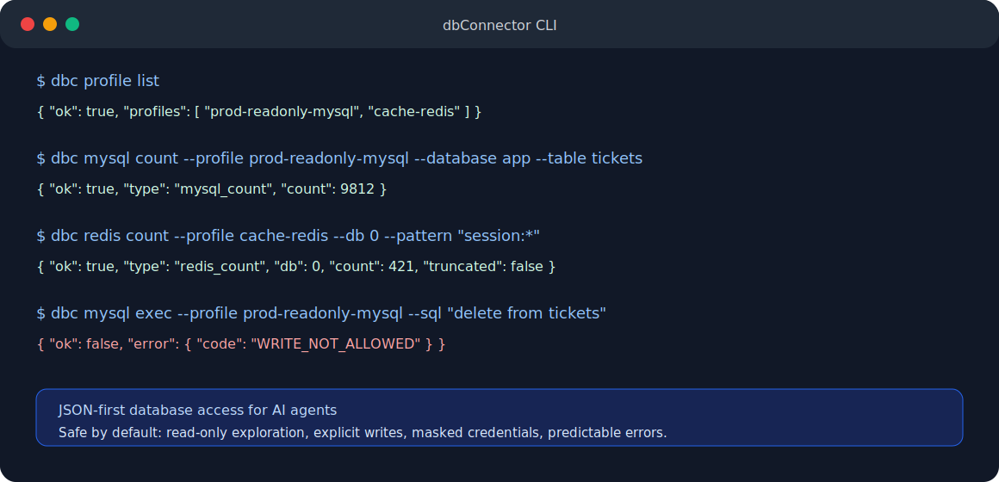

<p align="center">
  
</p>

<h1 align="center">dbConnector CLI</h1>

<p align="center">
  <strong>JSON-first MySQL and Redis access for AI agents</strong>
  <br />
  <strong>面向 AI Agent 的数据库连接、查询与安全操作命令行工具</strong>
</p>

<p align="center">
  <a href="https://github.com/xjk2000/dbConnectorCli"></a>
  
  
  
  
  
  
</p>

<p align="center">
  <a href="#quick-start">Quick Start</a> ·
  <a href="#features">Features</a> ·
  <a href="#commands">Commands</a> ·
  <a href="#configuration">Configuration</a> ·
  <a href="#中文说明">中文说明</a> ·
  <a href="docs/agent-usage.md">Agent Docs</a>
</p>

---

## What Is This?

`dbConnector CLI` is a small Go command line tool that gives AI agents controlled access to databases.

It is designed for agents that need to inspect schemas, run safe read-only queries, count rows or keys, and perform explicitly approved write operations.

Key design goals:

- predictable JSON output
- safe defaults for AI usage
- no interactive shell requirement
- no credential leakage in normal discovery commands
- minimal runtime footprint
- local-first configuration

## Why Agents Need It

Most agents can run shell commands, but raw database clients are hard to use safely:

- output is not always machine-friendly
- errors are inconsistent
- credentials can leak into logs
- write commands are too easy to run by accident
- large result sets can overwhelm the context window

`dbc` wraps common MySQL and Redis operations into stable commands with structured JSON responses.

## Features

- MySQL profile testing, schema inspection, read queries, row counting, explain, and guarded exec.
- Redis profile testing, info, scan, count, get, hgetall, ttl, type, set, and del.
- JSON response contract for both success and failure.
- Default read-only behavior.
- Write operations require `--write` and config permission.
- MySQL DSN is masked in `profile list`.
- Redis logical DB can be overridden per command with `--db`.
- Agent-facing documentation in [AGENTS.md](AGENTS.md) and [docs/agent-usage.md](docs/agent-usage.md).

## Quick Start

Build the binary:

```bash
go build -o bin/dbc ./cmd/dbc
```

Show help and version:

```bash
./bin/dbc -help
./bin/dbc -version
```

Check the active config path:

```bash
./bin/dbc config path
```

List available profiles:

```bash
./bin/dbc profile list
```

Test a profile:

```bash
./bin/dbc profile test --profile local-mysql
./bin/dbc profile test --profile local-redis
```

## Commands

### MySQL

List databases:

```bash
./bin/dbc mysql databases --profile local-mysql
```

List tables:

```bash
./bin/dbc mysql tables --profile local-mysql --database app --limit 100
```

Inspect a table:

```bash
./bin/dbc mysql table --profile local-mysql --database app --table users
```

Run a read-only query:

```bash
./bin/dbc mysql query --profile local-mysql --sql "select * from users limit 10"
```

Count table rows without returning rows:

```bash
./bin/dbc mysql count --profile local-mysql --database app --table users
```

Count rows returned by a read-only query:

```bash
./bin/dbc mysql count --profile local-mysql --sql "select * from users where status = ?" --params '["active"]'
```

Explain a query:

```bash
./bin/dbc mysql explain --profile local-mysql --sql "select * from users where id = 1"
```

Run a write command only when explicitly approved:

```bash
./bin/dbc mysql exec --profile local-mysql --sql "update users set name = ? where id = ?" --params '["Alice", 1]' --write
```

### Redis

Ping:

```bash
./bin/dbc redis ping --profile local-redis
```

Get keyspace info:

```bash
./bin/dbc redis info --profile local-redis
```

Scan sample keys:

```bash
./bin/dbc redis scan --profile local-redis --db 0 --pattern "session:*" --limit 20
```

Count matching keys without returning key names:

```bash
./bin/dbc redis count --profile local-redis --db 0 --pattern "session:*"
```

Read a string key:

```bash
./bin/dbc redis get --profile local-redis --db 0 --key "user:1"
```

Read a hash:

```bash
./bin/dbc redis hgetall --profile local-redis --db 0 --key "user:1"
```

Write only when explicitly approved:

```bash
./bin/dbc redis set --profile local-redis --db 0 --key "user:1" --value '{"name":"Alice"}' --ttl 3600 --write
./bin/dbc redis del --profile local-redis --db 0 --key "user:1" --write
```

## JSON Contract

Every command prints one JSON object.

Success:

```json
{
  "ok": true,
  "engine": "mysql",
  "profile": "local-mysql",
  "type": "mysql_count",
  "count": 9812,
  "elapsedMs": 12
}
```

Failure:

```json
{
  "ok": false,
  "engine": "mysql",
  "profile": "local-mysql",
  "error": {
    "code": "WRITE_NOT_ALLOWED",
    "message": "write operation requires --write",
    "retryable": false
  },
  "elapsedMs": 1
}
```

Agents should parse `ok` first. A failed command still returns valid JSON.

## Configuration

Default config path:

```text
~/.dbconnector/config.json
```

Use a custom config:

```bash
DBCONNECTOR_CONFIG=/path/to/config.json ./bin/dbc profile list
```

Example config:

```json
{
  "defaults": {
    "output": "json",
    "timeoutMs": 5000,
    "maxRows": 100,
    "allowWrite": false
  },
  "profiles": [
    {
      "name": "local-mysql",
      "type": "mysql",
      "dsnEnv": "LOCAL_MYSQL_DSN",
      "readonly": false,
      "maxRows": 200,
      "timeoutMs": 8000
    },
    {
      "name": "local-redis",
      "type": "redis",
      "addr": "127.0.0.1:6379",
      "db": 0,
      "readonly": false,
      "timeoutMs": 3000
    }
  ]
}
```

For MySQL, prefer `dsnEnv` over storing a raw DSN in the config file:

```bash
export LOCAL_MYSQL_DSN='user:password@tcp(127.0.0.1:3306)/app?parseTime=true&timeout=5s'
```

If `dsn` is configured directly, `profile list` only reports `dsnConfigured: true`; it does not print the DSN.

## Safety Model

Write operations require all of the following:

- the command includes `--write`
- `defaults.allowWrite` is `true`
- the profile is not `readonly`
- the command is part of the write allowlist

MySQL read allowlist:

- `SELECT`
- `SHOW`
- `DESCRIBE`
- `DESC`
- `EXPLAIN`

Redis does not expose dangerous commands such as `FLUSHALL`, `FLUSHDB`, `CONFIG`, `SHUTDOWN`, `EVAL`, or `SCRIPT`.

## Documentation

- [AGENTS.md](AGENTS.md): short instructions for AI agents.
- [docs/agent-usage.md](docs/agent-usage.md): detailed cross-agent usage guide.
- [docs/design.md](docs/design.md): design notes and implementation plan.
- [docs/config.example.json](docs/config.example.json): example config.

---

## 中文说明

`dbConnector CLI` 是一个给 AI Agent 使用的本机数据库命令行工具。

它不是传统交互式数据库客户端，而是一个受控执行器：Agent 可以通过它查看 MySQL / Redis 结构、执行只读查询、统计数据量，并在用户明确授权时执行写操作。

核心特点：

- 输出稳定 JSON，方便 Agent 解析。
- 默认只读，降低误操作风险。
- 写操作必须显式传 `--write`，并且配置中允许写入。
- MySQL 支持数据库、表、字段、索引、查询、计数、执行计划和受控写入。
- Redis 支持 info、scan、count、get、hgetall、ttl、type、set、del。
- `profile list` 不会输出 MySQL DSN 原文，避免泄露密码。
- 提供 [AGENTS.md](AGENTS.md) 和 [docs/agent-usage.md](docs/agent-usage.md)，方便大多数 Agent 直接读取和使用。

常用命令：

```bash
./bin/dbc profile list
./bin/dbc mysql count --profile local-mysql --database app --table users
./bin/dbc redis count --profile local-redis --db 0 --pattern "session:*"
```

如果你只想统计数量，优先使用 `mysql count` 或 `redis count`，不要用普通查询把大量数据拉出来再数。
